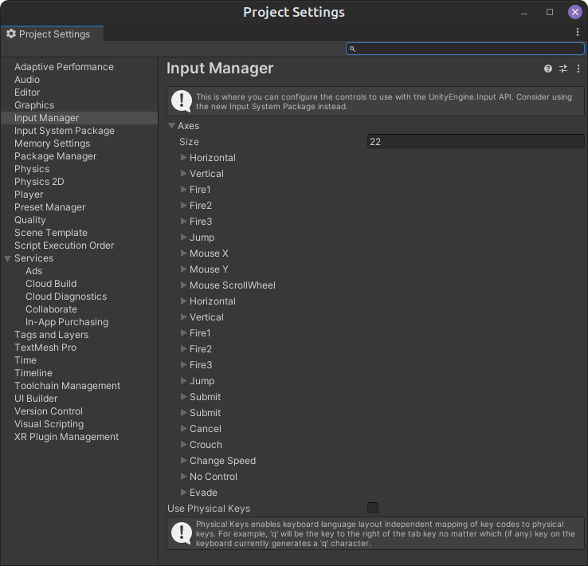
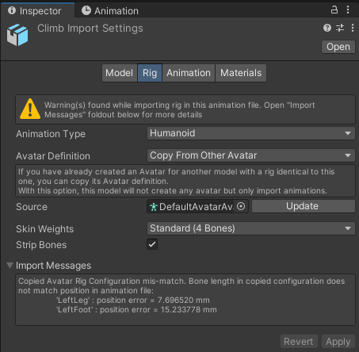

# Bugs discovered ...

## Editor Error

This is a bug.
```
System.InvalidOperationException: The operation is not possible when moved past all properties (Next returned false)
  at UnityEditor.SerializedProperty.get_stringValue () [0x00012] in /home/bokken/buildslave/unity/build/Editor/Mono/SerializedProperty.bindings.cs:914 
  at DevionGames.WriteInputManager.AxisDefined (System.String axisName) [0x0003c] in /home/tinka/Zenva/Under Development/DevionGames/Assets/Devion Games/Third Person Controller/Scripts/Editor/WriteInputManager.cs:84 
  at DevionGames.WriteInputManager..cctor () [0x00000] in /home/tinka/Zenva/Under Development/DevionGames/Assets/Devion Games/Third Person Controller/Scripts/Editor/WriteInputManager.cs:13 
UnityEditor.EditorAssemblies:ProcessInitializeOnLoadAttributes (System.Type[]) (at /home/bokken/buildslave/unity/build/Editor/Mono/EditorAssemblies.cs:130)
```
The basic issue is that the script expects to find all the required "Axes" defined in the "Input Manger".
Unfortunately the base code did not put in error checks for not finding them, 
so when it falls off the loop looking, but didn't find it keeps looking beyond the end of the desierialised data.
You are missing 4: 
* Crouch
* Change Speed
* No Control
* Evade



The only one I know, so far, is "Crouch", which is supposed to be keyboard 'c'.  
I set this and the other 3 to nothing, and this passes, but may cause another issue:

### State comes from an incompatible keyword space - wierd warning!

When I re-opened my project I was surprised and shoked to find this message.
As I had changed my Input manager settings and had 3 ill-defined cases, this may be the problem :-(
I will try and correct those and see if it goes away.

## Self-intersecting polygon mesh Warning

 A polygon of Mesh 'prop_fish_01' in Assets/Devion Games/Inventory System/Examples/Models/Fish/Fish.fbx is self-intersecting and has been discarded.

 At another time I discovered that using some polygon meshes have been dropped as collision meshes as well, 
 but unless you want to use the fish without fixing this, you are ok.  It's a warning after all!

## Animation Import Warnings

There are a number of them, and not easy to find.  
The message is: 
"File 'Climb' has rig import warnings. See Import Messages in Rig Import Tab for more details.",
where the File 'Climb' was one of many.  
If you search the project for, in this case, Climb, you will find a couple and the one you want is the "boxy" one.
It is an "Animation".  It will open in the inspector and the 3rd tab (Animation) is where the message is.
It tells you to open the 2nd tab (Rig) where you will be told to open the "Import Messages" foldout -
this the drop down by "Import Messages" and it will show the message:
'''
Copied Avatar Rig Configuration mis-match. 
Bone length in copied configuration does not match position in animation file:
"LeftLeg': position error = 7.696520 mm
'LeftFoot': position error = 15.233778 mm
'''
It is the same for all the files.  Looks like the "rig" had been adjusted on just the left leg and foor, but the animation not updated! - What do I know?  Hopeully it is now fixed.


## UI Utility scripts

* When the Inventroy System Example Scene - Main Scene
  * ScreenResolution does not handle the Editor Screen size very well! It throws an error:
  * IndexOutOfRangeException: Index was outside the bounds of the array.
  * DevionGames.UIWidgets.ScreenResolution.SetResolution (System.Int32 index) (at Assets/Devion Games/UI Widgets/Scripts/Runtime/Settings/ScreenResolution.cs:27)
  * DevionGames.UIWidgets.ScreenResolution.Start () (at Assets/Devion Games/UI Widgets/Scripts/Runtime/Settings/ScreenResolution.cs:16)

## Replacing DefaultAvatar with UMA

This highlighted some issues:

* The EquipmentHandler has a list of EquipableBones - places where things can go on the avata's rig
  * These are lots when the rig is replaced, fair enough
  * Adding them back, 
    * by either 
      * selecting bones from the UMA rig (not recommended)
      * adding new null bones into the rig and adding these (recommended)
    * doesn't work!
  * the EquipableBones in the database or possibly the items / prefabs are not "=", they may be .equal(), but that's not what's used
* Trying to use the "Item Reference Updater" tool, fails:
  * Firstly, because there is an ItemGroup and a Category of the same name "Teleporter" in the supplied example database
    * When ItemReferenceEditor.UpdateReference() tries to match one of them to the database, if matches with the other
      * Updating the reference then fails as you can't convert from on to the other!
  * Secondly, once fixing the check to also match Type as well as Name on the item, Unity Editor dissappears in a pudf of smoke!
    * The very clever, but badly implented Reflection code in ItemReferenceEditor calls UpdateReference() recursively without checks
      * In the Editor.log (in ~.config/unity3d) the last entry was out of resource error and it had over 8000 entries in the stack for that method call!
      * That would eat up all the space memory!

## EquipmentRegion and "=="

EquipmentRegion, and probably all the INameable classes, do not handle "==" or even Equals() well.
The lookup for various "items" will often do a `.Find(x => x.name == name)` type search on a collection.
An example is Equipmenthandler's GetBone(equipmentRegion) which tries to find an EquipmentBone using:

```Java
   EquipmentBone bone = Bones.Find(x => x.region == region);
```

But this fails if the EquipmentRegion used is not the same Object as the ones in the list, 
even though they are recognised by their INameable property, which seems to be considered as a unique name.
A fix in this case was to add the following code, but maybe this should be at the INameable interface.  Can it be done there though?  Maybe it can be done as a generic?

```Java
		public override bool Equals(object obj) => this.Equals(obj as EquipmentRegion);
		
		public bool Equals(EquipmentRegion p){
	        if (p is null)
    	    {
        	    return false;
	        }

    	    // Optimization for a common success case.
        	if (Object.ReferenceEquals(this, p))
	        {
    	        return true;
        	}

	        // If run-time types are not exactly the same, return false.
    	    if (this.GetType() != p.GetType())
        	{
            	return false;
        	}

	        // Return true if the fields match.
    	    // Note that the base class is not invoked because it is
        	// System.Object, which defines Equals as reference equality.
	        return (name == p.Name);
    	}

	    public override int GetHashCode() => (Name).GetHashCode();

    	public static bool operator ==(EquipmentRegion lhs, EquipmentRegion rhs){
	        if (lhs is null)
    	    {
        	    if (rhs is null)
            	{
                	return true;
	            }

    	        // Only the left side is null.
        	    return false;
	        }
    	    // Equals handles case of null on right side.
        	return lhs.Equals(rhs);
    	}

	    public static bool operator !=(EquipmentRegion lhs, EquipmentRegion rhs) => !(lhs == rhs);
```


