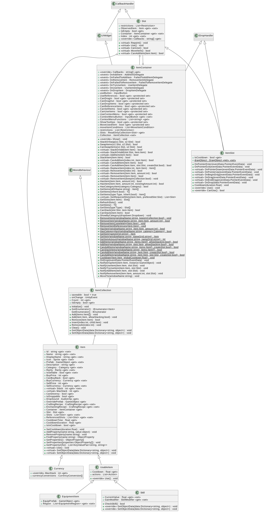

# Item Container and Item Collection

These two seem to be interlinked.  
They apear on the Inventory UI Object as a pair.
They are acutally more intwined than that:
* Linked to Items
* Linked to Slots

