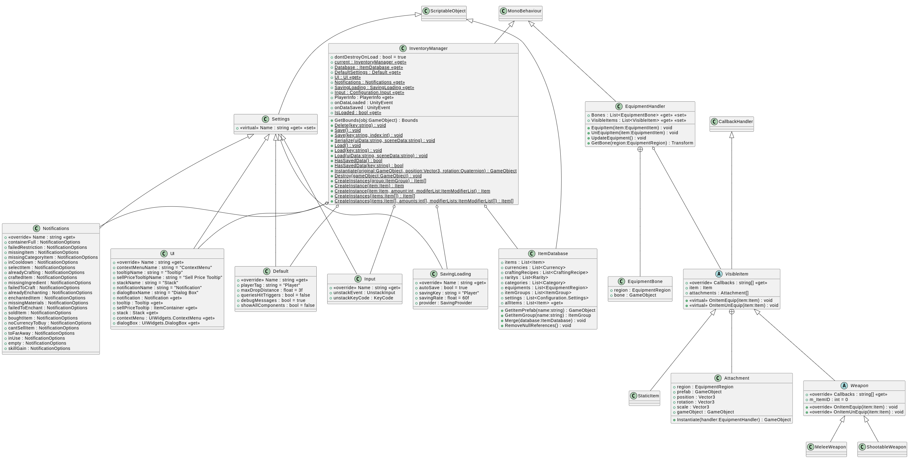

# Simple UML for the Inventory System

## Sub UMLs

* [Simple UML for the Inventory Manager](SimpleUMLInventoryManager.md)
* [Simple UML for Settings](SimpleUMLSettings.md)
* [Simple UML for the Equipment Handler](SimpleUMLEquipmentHandler.md)
* [Simple UML for Visible Item](SimpleUMLVisibleItem.md)

## Main UML

